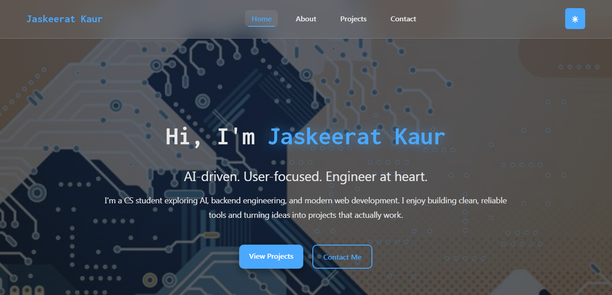

# Portfolio 

This is my personal portfolio website where I showcase my projects, skills, and experience.  
It is built using HTML, CSS, and JavaScript with a simple card-based UI.

<p align="center">
  
</p>

## Live Website
https://jaskeeratk.github.io/portfolio-website

## Tech Used
- HTML
- CSS
- JavaScript

## Sections
- Home
- About
- Skills
- Projects
- Experience
- Contact

## How to Run Locally
```bash
git clone https://github.com/JaskeeratK/portfolio-website
cd portfolio-website
open index.html
```
## Contact
Email: thejaskeerat@gmail.com
